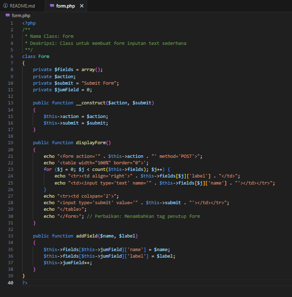
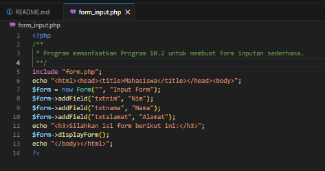
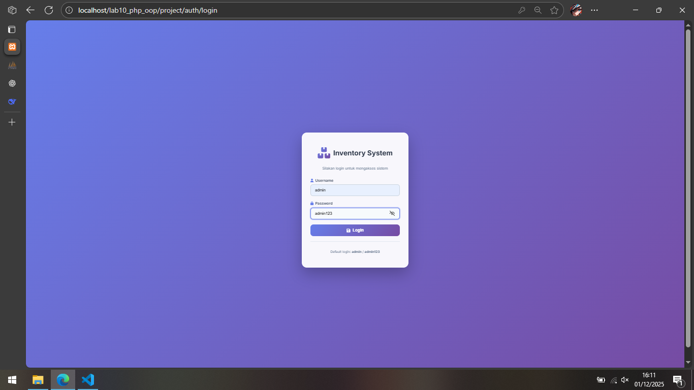
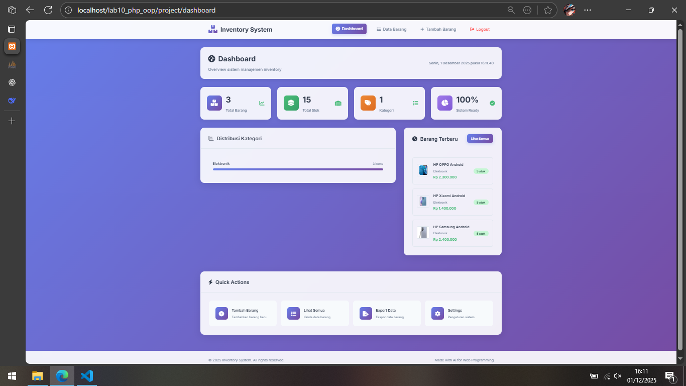
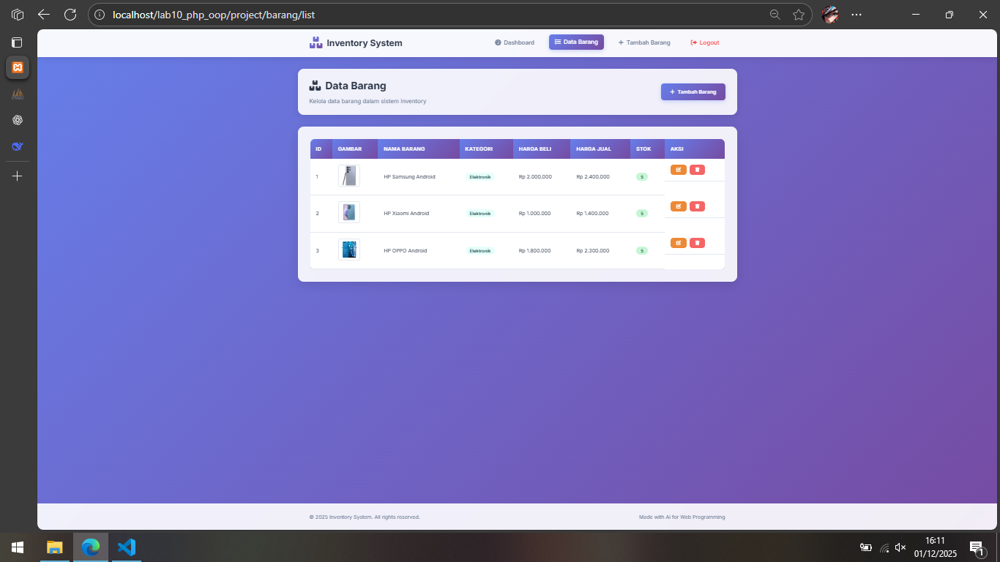
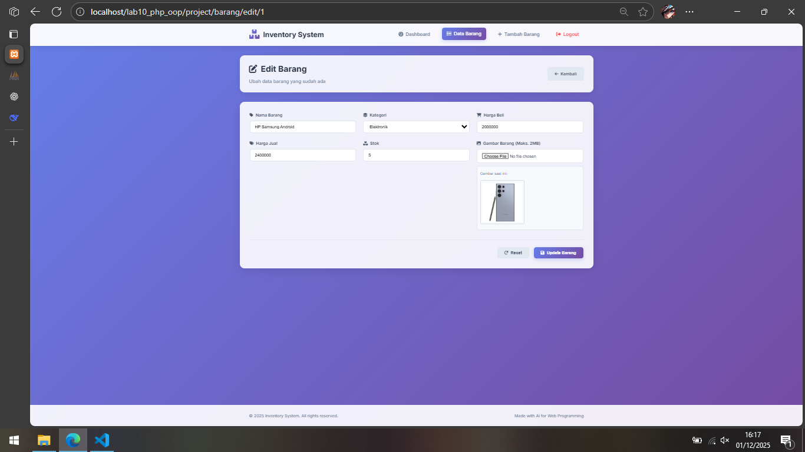
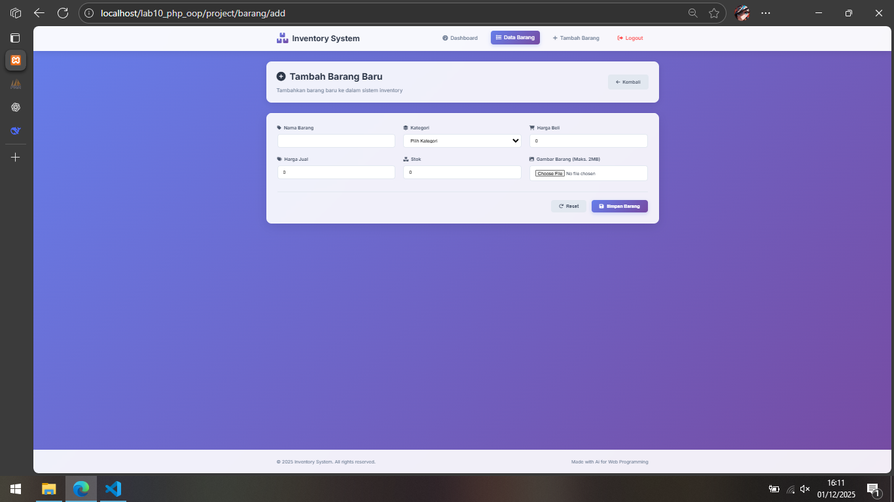

# Praktikum 10: PHP OOP
## Buat file baru dengan nama mobil.php


## Contoh class library untuk membuat form.
* Buat file baru dengan nama form.php



## Contoh implementasi pemanggilan class library form.php
* Buat file baru dengan nama form_input.php



* Contoh lainnya untuk database connection dan query. Buat file dengan nama database.php

```php
<?php
class Database {
    protected $host;
    protected $user;
    protected $password;
    protected $db_name;
    protected $conn;

    public function __construct() {
        $this->getConfig();
        // Menggunakan operator assignment untuk $this->conn
        $this->conn = new mysqli($this->host, $this->user, $this->password, $this->db_name); 
        if ($this->conn->connect_error) {
            die("Connection failed: " . $this->conn->connect_error);
        }
    }

    private function getConfig() {
        include_once("config.php");
        $this->host = $config['host'];
        $this->user = $config['username'];
        $this->password = $config['password'];
        $this->db_name = $config['db_name'];
    }

    public function query($sql) {
        return $this->conn->query($sql);
    }

    public function get($table, $where = null) {
        $whereClause = ""; // Inisialisasi variabel untuk klausa WHERE
        if ($where) {
            $whereClause = " WHERE " . $where;
        }
        $sql = "SELECT * FROM " . $table . $whereClause;
        $result = $this->conn->query($sql);
        // Perbaikan: Pastikan $result adalah objek mysqli_result sebelum memanggil fetch_assoc()
        if ($result && $result->num_rows > 0) {
            return $result->fetch_assoc();
        } else {
            return null; // Mengembalikan null jika tidak ada hasil
        }
    }
    
    public function insert($table, $data) {
        if (is_array($data)) {
            $column = []; // Inisialisasi sebagai array kosong
            $value = []; // Inisialisasi sebagai array kosong
            foreach ($data as $key => $val) {
                $column[] = $key;
                $value[] = "'{$val}'";
            }
            $columns = implode(",", $column);
            $values = implode(",", $value);
        } else {
            return false; // Mengembalikan false jika $data bukan array
        }

        $sql = "INSERT INTO " . $table . " (" . $columns . ") VALUES (" . $values . ")";
        $sqlResult = $this->conn->query($sql); // Variabel baru untuk hasil query
        
        if ($sqlResult === true) {
            return $sqlResult;
        } else {
            return false;
        }
    }

    public function update($table, $data, $where) {
        $update_value = []; // Inisialisasi sebagai array kosong
        if (is_array($data)) {
            foreach ($data as $key => $val) {
                // Perbaikan: Penggunaan operator assignment dan penambahan kutip pada nilai string
                $update_value[] = "$key='{$val}'"; 
            }
            $update_value_string = implode(",", $update_value); // Variabel baru untuk string
        } else {
             return false; // Mengembalikan false jika $data bukan array
        }
        
        $sql = "UPDATE " . $table . " SET " . $update_value_string . " WHERE " . $where;
        $sqlResult = $this->conn->query($sql); // Variabel baru untuk hasil query

        if ($sqlResult === true) {
            return true;
        } else {
            return false;
        }
    }

    public function delete($table, $filter) {
        $sql = "DELETE FROM " . $table . " " . $filter;
        $sqlResult = $this->conn->query($sql); // Variabel baru untuk hasil query

        if ($sqlResult === true) {
            return true;
        } else {
            return false;
        }
    }
}
?>
```

# Pertanyaan dan Tugas
## - Implementasikan konsep modularisasi pada kode program pada praktikum sebelumnya dengan menggunakan class library untuk form dan database connection.

## Jawaban
## (Kode sebelumnya Pratikum 9 dan Penyesuaian)

## Project
* [.htaccess](project/.htaccess)
* [index.php](project/index.php)

## assets
### -css
* [auth.css](project/assets/css/auth.css)
* [style.css](project/assets/css/style.css)

### -gambar

## config
### - Database di ubah menggunakan class library
* [database.php](project/config/database.php)

```php
<?php
/**
 * Class Database
 * Deskripsi: Class untuk koneksi dan operasi database
 */
class Database {
    private $host;
    private $user;
    private $password;
    private $db_name;
    private $conn;

    public function __construct() {
        $this->host = "localhost";
        $this->user = "root";
        $this->password = "";
        $this->db_name = "latihan1";
        
        $this->conn = new mysqli($this->host, $this->user, $this->password, $this->db_name);
        
        if ($this->conn->connect_error) {
            die("Koneksi ke server gagal: " . $this->conn->connect_error);
        }
    }

    public function getConnection() {
        return $this->conn;
    }

    public function query($sql) {
        return $this->conn->query($sql);
    }

    public function escape_string($string) {
        return $this->conn->real_escape_string($string);
    }

    public function insert($table, $data) {
        if (is_array($data)) {
            $columns = implode(",", array_keys($data));
            $values = "'" . implode("','", array_values($data)) . "'";
            
            $sql = "INSERT INTO $table ($columns) VALUES ($values)";
            return $this->conn->query($sql);
        }
        return false;
    }

    public function update($table, $data, $where) {
        if (is_array($data)) {
            $set = "";
            foreach ($data as $key => $value) {
                $set .= "$key='$value', ";
            }
            $set = rtrim($set, ", ");
            
            $sql = "UPDATE $table SET $set WHERE $where";
            return $this->conn->query($sql);
        }
        return false;
    }

    public function delete($table, $where) {
        $sql = "DELETE FROM $table WHERE $where";
        return $this->conn->query($sql);
    }

    public function get($table, $where = null) {
        $sql = "SELECT * FROM $table";
        if ($where) {
            $sql .= " WHERE $where";
        }
        
        $result = $this->conn->query($sql);
        if ($result && $result->num_rows > 0) {
            return $result->fetch_assoc();
        }
        return false;
    }

    public function getAll($table, $where = null, $order = null) {
        $sql = "SELECT * FROM $table";
        if ($where) {
            $sql .= " WHERE $where";
        }
        if ($order) {
            $sql .= " ORDER BY $order";
        }
        
        $result = $this->conn->query($sql);
        if ($result && $result->num_rows > 0) {
            return $result->fetch_all(MYSQLI_ASSOC);
        }
        return [];
    }

    public function close() {
        $this->conn->close();
    }
}
?>
```

## lib
### - Auth dan Form di ubah menggunakan class library
* [auth.php](project/lib/auth.php)

```php
<?php
/**
 * Class Auth
 * Deskripsi: Class untuk handling authentication
 */
class Auth {
    private $db;

    public function __construct($database) {
        $this->db = $database;
    }

    public function login($username, $password) {
        $username = $this->db->escape_string($username);
        $password = $this->db->escape_string($password);
        
        $sql = "SELECT * FROM users WHERE username='$username' AND password='$password'";
        $result = $this->db->query($sql);
        
        if ($result && $result->num_rows === 1) {
            $_SESSION['username'] = $username;
            $_SESSION['login_time'] = time();
            return true;
        }
        return false;
    }

    public function isLoggedIn() {
        return isset($_SESSION['username']);
    }

    public function logout() {
        session_destroy();
        header("Location: " . BASE_URL . "/auth/login");
        exit;
    }

    public function getUser() {
        return $_SESSION['username'] ?? null;
    }

    public function checkAccess() {
        if (!$this->isLoggedIn()) {
            header("Location: " . BASE_URL . "/auth/login");
            exit;
        }
    }
}
?>
```

* [form.php](project/lib/form.php)

```php
<?php
/**
 * Class Form
 * Deskripsi: Class untuk membuat form inputan
 */
class Form {
    private $fields = array();
    private $action;
    private $method = "POST";
    private $submit = "Submit Form";
    private $enctype = "";
    private $resetButton = true;

    public function __construct($action = "", $submit = "Submit", $method = "POST", $enctype = "") {
        $this->action = $action;
        $this->submit = $submit;
        $this->method = $method;
        $this->enctype = $enctype;
    }

    public function addField($name, $label, $type = "text", $value = "", $options = array()) {
        $this->fields[] = array(
            'name' => $name,
            'label' => $label,
            'type' => $type,
            'value' => $value,
            'options' => $options
        );
    }

    public function setResetButton($show) {
        $this->resetButton = $show;
    }

    public function render() {
        $enctypeAttr = $this->enctype ? " enctype='{$this->enctype}'" : "";
        echo "<form action='{$this->action}' method='{$this->method}'{$enctypeAttr} class='form'>";
        echo '<div class="form-grid">';
        
        foreach ($this->fields as $field) {
            $this->renderField($field);
        }
        
        echo '</div>';
        echo '<div class="form-actions">';
        
        if ($this->resetButton) {
            echo "<button type='reset' class='btn btn-secondary'><i class='fas fa-redo'></i> Reset</button>";
        }
        
        echo "<button type='submit' class='btn btn-primary'><i class='fas fa-save'></i> {$this->submit}</button>";
        echo '</div>';
        echo '</form>';
    }

    private function renderField($field) {
        echo '<div class="form-group">';
        echo "<label for='{$field['name']}' class='form-label'>";
        
        // Add icon based on field type
        $icon = $this->getIcon($field['name']);
        if ($icon) {
            echo "<i class='fas fa-{$icon}'></i>";
        }
        
        echo "{$field['label']}</label>";
        
        switch ($field['type']) {
            case 'select':
                echo "<select id='{$field['name']}' name='{$field['name']}' class='form-control' required>";
                echo "<option value=''>Pilih {$field['label']}</option>";
                foreach ($field['options'] as $key => $value) {
                    $selected = ($key == $field['value']) ? "selected" : "";
                    echo "<option value='{$key}' {$selected}>{$value}</option>";
                }
                echo "</select>";
                break;
                
            case 'file':
                echo "<input type='file' id='{$field['name']}' name='{$field['name']}' class='form-control' accept='image/*'>";
                if (isset($field['options']['current'])) {
                    if ($field['options']['current']) {
                        // Tampilkan gambar preview jika ada
                        echo "<div class='current-image-preview'>";
                        echo "<small class='form-text'>Gambar saat ini:</small><br>";
                        echo "";
                        echo "</div>";
                    } else {
                        echo "<small class='form-text'>Belum ada gambar</small>";
                    }
                }
                break;
                
            case 'number':
                $min = isset($field['options']['min']) ? "min='{$field['options']['min']}'" : "";
                $step = isset($field['options']['step']) ? "step='{$field['options']['step']}'" : "";
                echo "<input type='number' id='{$field['name']}' name='{$field['name']}' class='form-control' value='{$field['value']}' required {$min} {$step}>";
                break;
                
            case 'password':
                echo "<input type='password' id='{$field['name']}' name='{$field['name']}' class='form-control' value='{$field['value']}' required>";
                break;
                
            default:
                echo "<input type='{$field['type']}' id='{$field['name']}' name='{$field['name']}' class='form-control' value='{$field['value']}' required>";
                break;
        }
        
        echo '</div>';
    }
    
    private function getIcon($fieldName) {
        $icons = [
            'nama' => 'tag',
            'kategori' => 'layer-group',
            'harga_beli' => 'shopping-cart',
            'harga_jual' => 'tags',
            'stok' => 'boxes',
            'file_gambar' => 'image',
            'username' => 'user',
            'password' => 'lock'
        ];
        
        return isset($icons[$fieldName]) ? $icons[$fieldName] : 'edit';
    }
}
?>
```

## modules
### -auth
* [login.php](project/modules/auth/login.php)
* [logout.php](project/modules/auth/logout.php)

### -barang
* [add.php](project/modules/barang/add.php)
* [delete.php](project/modules/barang/delete.php)
* [edit.php](project/modules/barang/edit.php)
* [list.php](project/modules/barang/list.php)

## views
* [dashboard.php](project/views/dashboard.php)
* [footer.php](project/views/footer.php)
* [header.php](project/views/header.php)


# Tampilan sama dan penyesuaian
## Form login


## Dashboard


## List barang


## Edit barang


## Tambah barang
# Lab10Web
